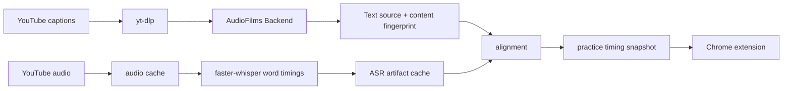

# ASR Artifact Reuse and Timing Alignment

## Status

Accepted. The worker implementation separates source refresh from ASR refresh.

## Context

`Improve Timing` combines two different computations:

1. obtaining a word-timestamped transcript from the video audio with ASR;
2. aligning the selected caption text to those word timings.

The ASR pass is expensive and depends on the audio artifact, normalized
language, engine, model, and compute settings. Alignment is comparatively cheap
and depends on the selected text source and its content revision. A changed or
stale caption revision must not cause the same audio to be transcribed again.

Previously, a stale timing snapshot set the job's generic `refresh` flag. The
worker passed that flag to the smoke script, which invalidated audio, captions,
and ASR artifacts together. This made a legitimate alignment refresh pay the
full ASR cost again.

## Decision

AudioFilms treats ASR transcript artifacts and timing/alignment artifacts as
separate cache layers:

- the ASR word-timing artifact is reusable when the audio and ASR inputs are
  unchanged;
- the alignment artifact is reusable only when its selected text source
  revision/content fingerprint is unchanged;
- a stale text-source revision refreshes captions and alignment inputs while
  reusing the ASR word-timing artifact;
- a full ASR refresh is explicit and reserved for changed audio, model/engine/
  compute configuration, corrupted artifacts, or operator action;
- model selection is a backend concern and is part of the ASR artifact
  identity, not a normal extension-level refresh option.

The worker therefore uses `--refresh-source` for stale timing inputs. The
smoke script keeps `--refresh` as an explicit full refresh and also supports
separate `--refresh-audio` and `--refresh-asr` flags.

## Retrieval and identity

The backend boundary is the service name shown in diagnostics. The concrete
source/extractor remains visible after the boundary, so `Backend Provider ·
yt-dlp` means “AudioFilms backend, using yt-dlp internally.” A configured
third-party path would be shown as `Backend Provider · Supadata`.



Reuse is determined by artifact identity, not by the display language label
alone:

```text
ASR artifact = video + audio fingerprint + normalized language
               + engine + model + compute settings
Timing artifact = selected text content fingerprint + ASR artifact identity
```

Thus `nl-NL` and `nl` refer to the same normalized language for compatibility,
while changed audio, ASR configuration, or text content creates a new artifact.

## Consequences

- Re-running `Improve Timing` for the same audio can finish through the cheap
  caption/alignment path instead of repeating Whisper transcription.
- A new caption revision can still produce a new timing snapshot without
  replacing the selected text source with an ASR transcript.
- ASR results remain valid across caption revisions, but not across changed
  audio, model, engine, or compute settings.
- Cache metadata and diagnostics should continue to expose both the ASR
  artifact identity and the text-source/alignment revision so stale results are
  explainable.
- Direct `--refresh` smoke runs remain available for deliberate full rebuilds.
